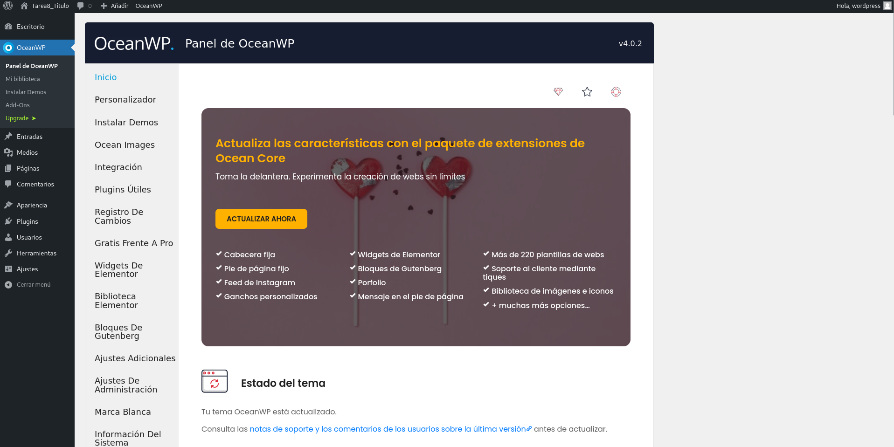
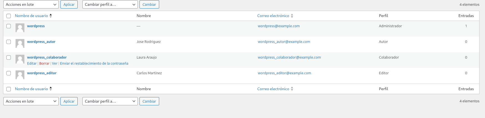

# Tarea 8

### 1. Creamos el docker-compose.yml(Explico todo en el archivo)

### 2. Lo levantamos con:

```bash

docker-compose up -d
```

### 3. Entro al servicio wordpress con la ip del anfritión desde el navegador, una vez dentro escribo mi nombre de usuario y la contraseña generada aleatoriamente.

### 4. Instalo un tema para Wordpress:



### 5. Creo 3 roles nuevos cada uno con diferente perfil :

